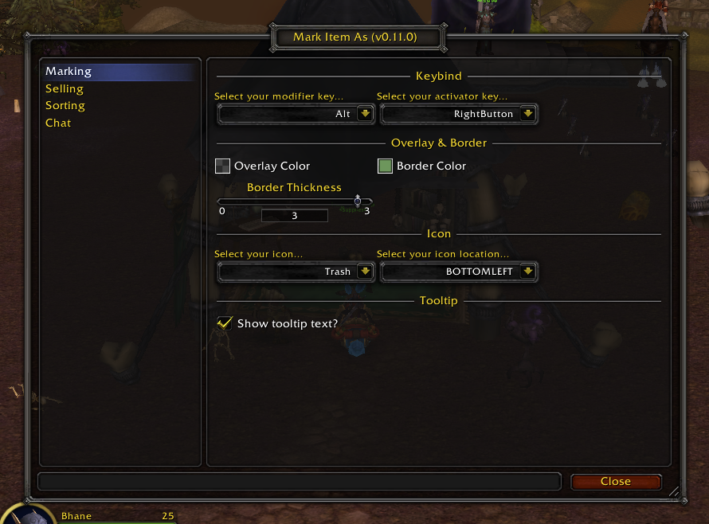
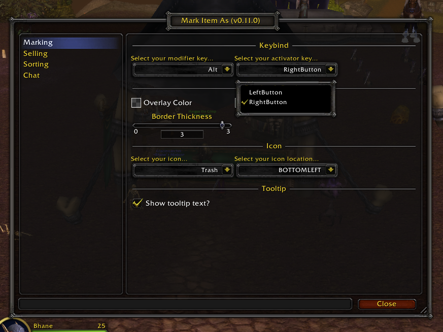
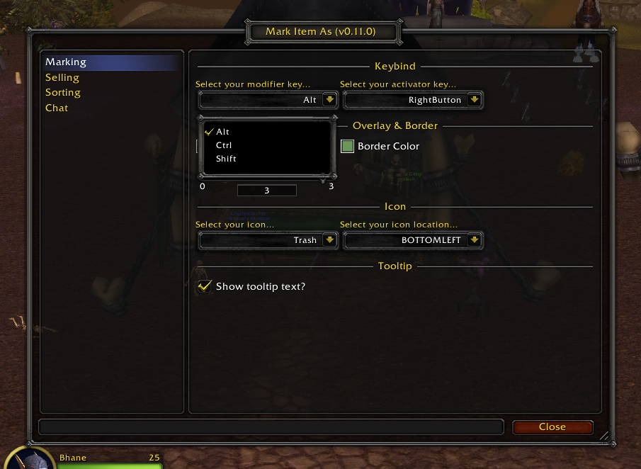
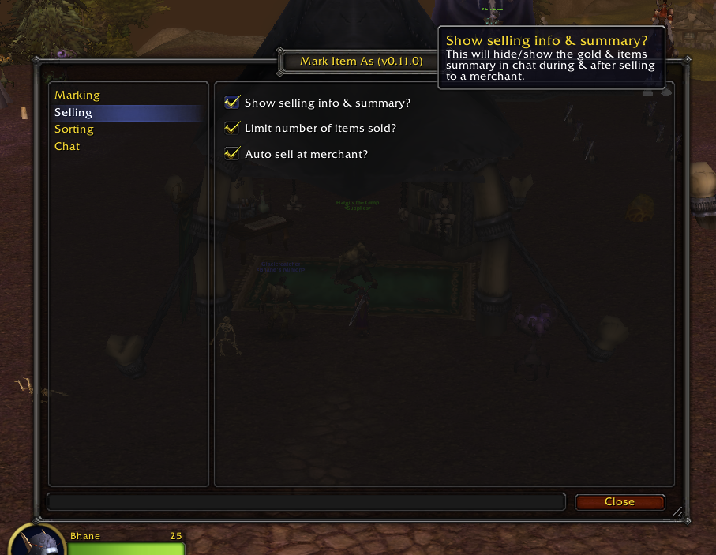
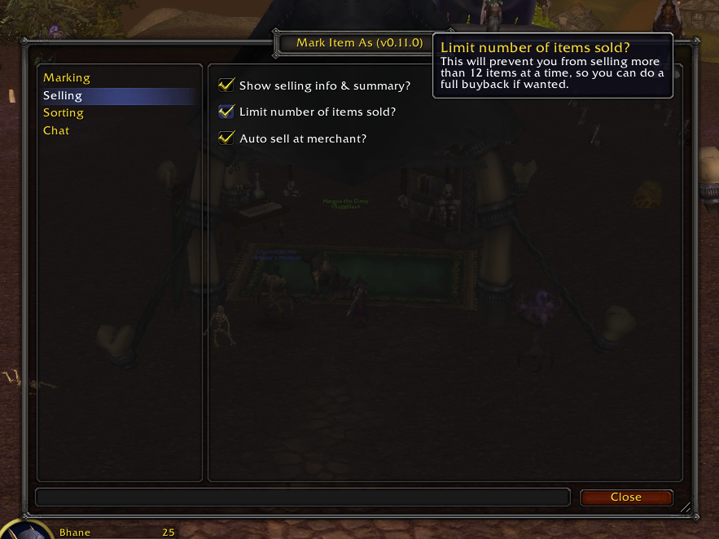
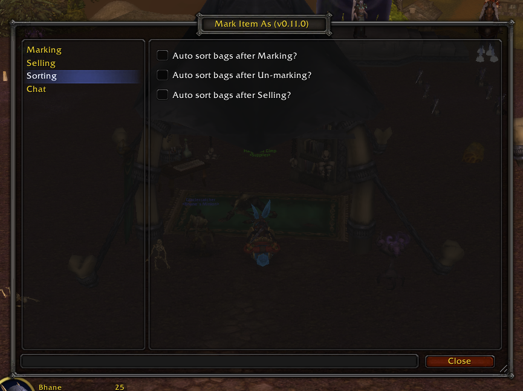
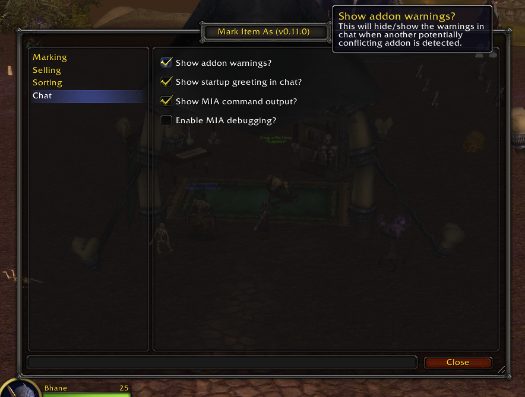

# Mark Item As 

## Overview 

"Mark Item As" is a World of Warcraft (WoW) utility add-on that helps you mark & automatically sell items that you don't want to keep. 

## How It Works 

MarkItemAs (a.k.a. MIA) is easy to use. Mark any items you don't want to keep with the pre-defined (or a custom) click combo and when you visit a merchant, those items will be automatically sold. 

To use the click combo, just hover your mouse over the item you want to mark and activate the combo. 

If you have duplicate or multiple items, marking one item/stack will mark all items that are the same. Similarly, un-marking one item/stack will un-mark all other items that are the same. 

Another feature of MIA is that you can auto-sort your bags after marking, un-marking, and/or selling. 

## Options & Defaults 

There are 4 main groups of options:

1. [ `Marking`](#marking) 
2. [ `Selling`](#selling) 
3. [ `Sorting`](#sorting) 
4. [ `Chat`](#chat) 

### Marking 

#### Combo Activator Key 

This is the main mouse button that you will use to trigger marking/un-marking your items. The possible options are:

1. `LeftButton` 
2. `RightButton` (*this is the default value*) 

#### Combo Modifier Key 

This is the supplementary keyboard modifier that you will use with the mouse click to mark/un-mark items. The possible options are:

1. `Alt` (*this is the default value*) 
2. `Ctrl` 
3. `Shift` 

#### Item Overlay & Border 

The overlay & border are visual indicators to help you identify which items you've marked. The overlay is a color mask that sits on top of the items artwork. And the border is a set of colored lines that surround the item/bag slot. The color of the overlay and border are customizable using a color picker which has an alpha/transparency setting. The thickness of the border can be adjusted using a slider. The following *default values* are:

Overlay Color:  `{ r = 0, g = 0, b = 0, a = 0.75 }` (this is black with a 75% opacity) 

Border Color:  `{ r = 0.4, g = 0.4, b = 0.4, a = 1 }` (this is a dark-medium gray with 100% opacity) 

Border Thickness: `2` (the slider has a min value of `0` and a max value of `5`) 

#### Marker Icon 

When you mark an item, a small icon will appear on top of the item and the overlay. The location and the type of icon are customizable via dropdown menus where you can select different values. The possible options are: 

##### Icon Image 

1. `Coin` (this is similar to the coin icon that Scrap displays) 
2. `Stack` 
3. `Trash` (*this is the default value*) 

 

##### Icon Location 

1. `Top Left` 
2. `Top Center` (a.k.a. TOP) 
3. `Top Right` 
4. `Center Left` (a.k.a. LEFT) 
5. `Center` 
6. `Center Right` (a.k.a. RIGHT) 
7. `Bottom Left` (*this is the default value*) 
8. `Bottom Center` (a.k.a. BOTTOM) 
9. `Bottom Right` 

#### Tooltip Text +

With this enabled, a line of text ("Marked as Junk - To be sold") will be added to the bottom of the item's tooltip after you mark it. 

This can be toggled `on` or `off` via a checkbox. It is `on` by *default*. 

### Selling 

#### Sale Summary 

After visiting a merchant, and selling your items, MIA will display a summary of the items you sold. The summary includes the following info: 

- A breakdown list of each item (or stack) sold: 
   - How much each item/stack was sold for 
   - The total amount made from that item/stack 
- A total summary of: 
   - How much money you made overall 
   - How many unique items were sold 
   - How many total items were sold 
   - A list of all items as `ItemLink`'s (to easily hover and see the in-game tooltip info) 

This can be toggled `on` or `off` via a checkbox. It is `on` by *default*. 

> NOTE: If "auto-sell" is disabled, the sale summary will not be printed out. 

#### Sale Limit 

By *default*, MIA will limit the sale of marked items to 12, which is the most buyback items a merchant can hold at any one time. The items sold are determined by their place in the bags. 

MIA will start with the backpack and then will work its way up until it reaches the last (i.e. top most) bag. 

As it hits each bag, it will go through the bag slots from the top left corner down to the bottom right corner. 

Once it reaches a count of 12, it will stop selling. And if auto-sort is turned on, the items will re-arrange themselves. 

If the limit is disabled, everything marked gets sold. 

#### Auto Sell 

Upon visiting a merchant, with this option checked, all of the marked items in your bags (or up to 12 if the limit is enabled) will be automatically sold.  

You can disable this if you still want to manually sell the items, but I'm not sure why you'd want to. 😉 

### Sorting 

These options are pretty straight-forward. 

If you **MARK** an item, and #1 is enabled, the bags get sorted. 

If you **UN-MARK** an item, and #2 is enabled, the bags get sorted. 

If you visit a merchant with #3 & "auto-sell" enabled, and at least 1 item is sold, the bags get sorted after leaving the merchant. 

> NOTE: If "auto-sell" is disabled, the bags will not be automatically sorted when manually selling marked items. 

### Chat 

This group of options deals strictly with what you'll see in the chat pane output. 

Some features may be useful to normal players, while others are more geared for other add-on devs who want to get an inside look at what MIA is actually doing.  

#### Show Add-On Warnings 

This checkbox will hide or display specific warnings for some add-ons that may cause conflicts. See [Working with Other Add-Ons](#Working with Other Add-Ons) for more details. 

## Working with Other Add-Ons 

### Baggins 

Future work may be done to fully support the Baggins add-on. But, right now, during this initial phase, MIA will detect if Baggins is loaded and disable its own auto-sorting features. 

This is done out of pre-caution to prevent any possible conflicts or just weird behavior. 

If full support is added for Baggins, and it's discovered that there is no conflict with having both auto-sort functionalities enabled, then this preventative measure may be removed. 

### ItemLock 

m 

### Peddler 

m 

## Support 

If you encounter any bugs or issues, please submit them here on [GitHub](https://github.com/gflujan/mark-item-as/issues). 

You can leave comments on [CurseForge](https://www.curseforge.com/wow/addons/mark-item-as), and I'll check them periodically, but you're more likely to get a faster response on GitHub. 

## Future Features 

- Add support for Bagnon & Baggins add-ons 
- Add options to enable / disable the overlay & border 
- Add more icon options 
- Ability to mark items as "ready for auction" 
- Add bank, guild bank, and possibly void storage support 
- (potentially) Add support for other popular bag add-ons 
- (potentially) Add support for multiple user profiles 
- (potentially) Add more options for activator & modifier keys 

